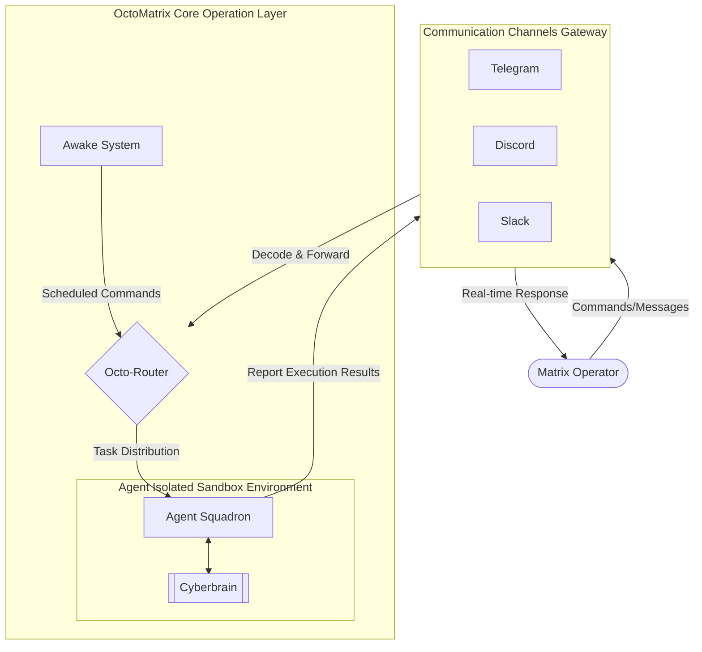

<div align="center">
  
</div>

# 🐙 OctoMatrix: The Autonomous Agent Matrix ☀️🌙

> A Ghost requires a Shell to touch the world, and a Shell requires a Matrix to exist. We forge their Cyberbrains, open the channels, and watch them dive.

## 📖 Project Overview

**OctoMatrix** is a remote AI collaboration environment specifically designed to break communication boundaries. It seamlessly integrates a powerful AI engine with three carefully selected communication platforms: **Telegram, Discord, and Slack**.

This is not merely a chatbot, but a complete **AI team ecosystem**. As a "Matrix Operator," you can command multiple AI Agents with distinct responsibilities from anywhere, anytime, using your phone or computer. Through dedicated workspace isolation, dynamically configured team collaboration, and a long-term state maintenance mechanism based on **Cyberbrain**, AI assistants will continuously execute tasks in the background like a real team.

The system natively supports Linux (e.g., Ubuntu/Debian/CentOS/RHEL) and macOS, and can be run on Windows via WSL.

## 🧩 Conceptual Architecture


---
## ✨ Core Features
*   **Conversation as Command**: Simply send a message in any communication platform to directly command remote AI to execute complex commands and tasks.
*   **Multi-Agent Squadron**: Support simultaneous configuration of multiple Agents with different specialties (such as data retrieval, code authoring, logical analysis).
*   **Uninterrupted Cross-Platform Support**: Support for Telegram, Discord, and Slack. When a commonly used communication platform becomes unstable, seamlessly switch to another platform while keeping the AI team and task progress synchronized.
*   **Cyberbrain System**: A long-term memory mechanism using "grep-based RAG" in place of traditional vector retrieval. Paying homage to the "GHOST in the SHELL" concept, AI will "compress" and "imprint" conversation highlights as high-density GHOST indices, and through "Deep Dive" technology extract historical context at the physical level from SHELL records, granting Agents efficient retrospection ability that breaks through context window limitations.
*   **Agent Harness Framework**: Distinct from the unpredictable black-box nature of traditional LLMs, a system-level Harness framework is introduced for the Agents. By constraining the AI's divergent thinking through a strict, standardized underlying workflow, it ensures every collaboration is predictable, observable, and highly stable.
*   **Zero-Threshold Configuration Wizard**: Provides 100% interactive installation wizard, allowing you to easily create your own AI team without manually modifying complex code or configuration files.
*   **Awake Tasks**: Support assigning periodic or scheduled tasks directly through natural language. The system will automatically wake up the Agent at the specified time to execute background work.
*   **Agent-to-Agent Interaction**: Agents have the ability to delegate tasks and communicate with each other, enabling division of labor and logical cross-checking.
*   **Role Awareness**: Agents are imbued with unique personalities and automatically send exclusive Avatar stickers reflecting their current emotional state based on the context of the conversation.

---

## 🎭 Role Awareness & Avatar Aesthetics

OctoMatrix not only empowers Agents with task execution capabilities but also emphasizes their "self-awareness" and "visual emotion."

Through deep system prompts and contextual settings, each Agent is imbued with a unique personality, tone, and set of responsibilities. Accompanying every conversation and status report, the Agent automatically selects and sends a corresponding Avatar emoji based on the current context (e.g., thinking, happy, apologetic, eureka moment), injecting a warm soul into the cold terminal dialogue.

<p align="center">
  
</p>
<p align="center">
  
  &nbsp;
  
</p>

---

## 📖 Obtaining Communication Channel Credentials (Choose at least one)

### 1. Obtaining Telegram Credentials (Simplest)

*   **A. TELEGRAM_BOT_TOKEN**
    1. Search for the official account **@BotFather** in Telegram and start a conversation.
    2. Send the `/newbot` command and enter the bot name as prompted.
    3. After successful creation, BotFather will provide an **HTTP API Token**.

*   **B. TELEGRAM_CHAT_ID**
    1. Make sure you have entered the Token in the configuration wizard.
    2. Send `/start` to the bot's chat in Telegram.
    3. **The configuration wizard will automatically detect** and retrieve the chat ID.

*   **C. ngrok Authtoken**
    1. Register and log in to [ngrok](https://dashboard.ngrok.com/get-started/your-authtoken).
    2. Find **Your Authtoken** in the left column of the page.
    3. Copy the Token and enter it in the configuration wizard later.

### 2. Obtaining Discord Credentials

*   **A. Create a Dedicated Server (Prerequisite)**
    1. If you don't have a dedicated server yet, open the Discord client and click **+ Add Server** at the bottom of the left sidebar.
    2. Select **Create Your Own** and complete the creation to use it for inviting bots and retrieving IDs later.

*   **B. DISCORD_BOT_TOKEN**
    1. Go to [Discord Developer Portal](https://discord.com/developers/applications).
    2. Click **New Application** in the top right corner, enter a name, and create it.
    3. Select **Bot** from the left menu.
    4. Click **Reset Token** and copy the generated Token (keep it safe, it will only be displayed once).
    5. Close the public bot: Go to **Installation** in the left menu and change **Install Link** to **None**. Then go back to the **Bot** page, turn off **Public Bot**, and save to prevent strangers from adding this bot to other servers. (If you don't set Install Link to None first, Discord won't allow you to save this change).
    6. Scroll down and enable the **Message Content Intent** toggle, otherwise the bot won't be able to read message content. (Note: The Bot Permissions at the bottom of this page are just system defaults; you can ignore this section and don't need to check anything).
    7. Invite the bot: Since you've disabled Public Bot, you can't use the default authorization link. Go to **OAuth2 > OAuth2 URL Generator** in the left menu, check the **bot** scope, and in the **Bot Permissions** below, check the required permissions. It's recommended to check **View Channels**, **Send Messages**, **Read Message History**, and **Attach Files**. Then copy the URL at the bottom and paste it in your browser to add the bot to your dedicated server.

*   **C. Enable Developer Mode (Prerequisite)**
    1. Open the Discord client and click **User Settings** (gear icon) in the bottom left.
    2. Find **Developer** in the left menu.
    3. Toggle **Developer Mode** to on.

*   **D. DISCORD_SERVER_ID**
    1. In the Discord server list, right-click the target server's icon or name.
    2. Select **Copy Server ID** at the bottom of the menu.

*   **E. DISCORD_CHANNEL_ID**
    1. Create a dedicated text channel in the server (since it's within a closed server, you don't need to create a private channel).
    2. In the server's channel list, right-click the target channel.
    3. Select **Copy Channel ID** at the bottom of the menu.

### 3. Obtaining Slack Credentials

*   **A. Create a Dedicated Workspace (Prerequisite)**
    1. If you don't have a dedicated workspace yet, go to [Slack's official website](https://slack.com/create) to create one.
    2. Follow the instructions to complete creation for subsequent Slack App installation and isolated AI conversations.

*   **B. Create a Slack App**
    1. Go to the [Slack API: Your Apps](https://api.slack.com/apps) page.
    2. Click **Create New App** and select **From scratch**.
    3. Name the App and select the workspace you just created.

*   **C. SLACK_BOT_TOKEN (xoxb-)**
    1. Go to **Features > OAuth & Permissions** in the left menu.
    2. Scroll down to **Scopes** and add the following required permissions in **Bot Token Scopes**:
       *   `app_mentions:read` (Read mentions)
       *   `channels:history`, `channels:read` (Read public channel messages and information)
       *   `chat:write` (Send messages)
       *   `files:read`, `files:write` (Read and upload files)
       *   `im:history`, `mpim:history` (Read direct message history)
       *   `users:read` (Read user information)
    3. Go back to the top of the page and click **Install to Workspace** and complete authorization.
    4. Copy the generated **Bot User OAuth Token** (starting with `xoxb-`).

*   **D. SLACK_APP_TOKEN (xapp-)**
    1. Go to **Settings > Basic Information** in the left menu.
    2. Scroll down to the **App-Level Tokens** section.
    3. Click **Generate Token and Scopes**, enter a name, and add the `connections:write` permission (required for Socket Mode).
    4. Click Generate and copy the Token (starting with `xapp-`).

*   **E. Enable Socket Mode**
    1. Go to **Settings > Socket Mode** in the left menu.
    2. Toggle **Enable Socket Mode** to on.

*   **F. Set up Event Subscriptions (Required for Socket Mode)**
    1. Go to **Features > Event Subscriptions** in the left menu.
    2. Toggle **Enable Events** to on.
    3. Expand the **Subscribe to bot events** section and add the following permissions:
       *   `app_mention`
       *   `file_shared`
       *   `message.channels`
       *   `message.im`
       *   `message.mpim`
    4. Click **Save Changes**.

*   **G. SLACK_WORKSPACE_ID & SLACK_CHANNEL_ID**
    1. Create a dedicated channel in the Workspace (since it's within a closed workspace, you can directly use a public channel).
    2. Log in to the web version [app.slack.com](https://app.slack.com/) and enter the target channel.
    3. Observe the address bar; the structure is usually `https://app.slack.com/client/T.../C...`.
    4. **Workspace ID** is the string starting with `T` in the URL.
    5. **Channel ID** is the string starting with `C` in the URL.
    6. *Note: You must type `/invite @bot_name` in the target channel to invite the bot; otherwise the bot won't be able to send messages.*
---

## 🚀 Quick Start

OctoMatrix simplifies the tedious manual editing of configuration files and provides a user-friendly interactive installation wizard. Just follow the terminal prompts in order, and the system will automatically complete all configurations!

### 1. Get Source Code and Install Dependencies
First, obtain the project source code and run the built-in installation script. The system will automatically install the required Python packages, Node.js, and various AI CLI tools.
```bash
git clone https://github.com/meso4444/OctoMatrix.git
cd OctoMatrix

# Install basic environment dependencies (required for local environment)
./install_dependencies.sh
```

### 2. Run Full Configuration Wizard (Setup Wizard)
After dependencies are installed, start the interactive configuration wizard. You can complete all system settings in this centralized menu:
```bash
./setup_config.sh
```

**Wizard Main Menu Features:**
*   **[1] 👤 Set Username (Username)**: Set your preferred name, which the Agents will use to address you.
*   **[2]-[4] Communication Channel Setup**: Guide for binding Telegram, Discord, or Slack tokens, and you can toggle specific channels anytime.
*   **[5] 🌍 Network & Ports Setup (Ports)**: Customize local port numbers for Router, Gateway, and ngrok tunnel to avoid conflicts with other services on your host.
*   **[6] 🤖 Configure AI Agent Squadron & Advanced Parameters**:
    *   **Configure Agent**: Name the AI, specify its **usecase** (for AI awareness) and **description** (for menu display to users), and freely combine AI engines (Gemini, Claude, Codex, or agy (Antigravity)) with models.
    *   **Configure Agent Collaboration Groups**: Create team shared spaces and specify mutual supervision and task delegation relationships between agents within groups.
    *   **Communication Menu Configuration**: In addition to the system's built-in basic menu, you can "customize dedicated buttons" to bind commonly used prompts or commands to graphical buttons for one-click sending.
*   **[7] 🔐 AI Agent CLI Authentication Setup**: Built-in authentication flow to help you with one-click authorization from Google, Anthropic, or OpenAI to complete terminal login.
*   **[8] ⬆️ AI CLI Version Management (Upgrade/Rollback)**: Built-in mechanism to upgrade or rollback various AI CLI tools, ensuring optimal compatibility between underlying tools and the project.

### 3. Start the System (Native Local Mode)
After completing the wizard setup and authentication above, you can directly start the AI matrix locally!
```bash
./start_octo_services.sh
```

### 4. Containerized Deployment (Docker Optional Advanced Mode)
If you want to run multiple independent matrices on the same server or have stricter system isolation, you can also choose to deploy using Docker.
```bash
./install_docker.sh
cd docker-deploy

# 1. Run Docker-specific wizard and generate configuration as prompted
./setup_docker.sh

# 2. Start dedicated container
docker compose -f docker-compose.${INSTANCE_NAME}.yml -p octo_${INSTANCE_NAME} build --no-cache && docker compose -f docker-compose.${INSTANCE_NAME}.yml -p octo_${INSTANCE_NAME} up -d
```

---

## 🛠️ Auto-Startup & Advanced Deployment

OctoMatrix supports configuring the service as a background daemon (Phoenix Mode), allowing your AI team to automatically resurrect after a host reboot.
* **Linux Environment**: Please refer to the documentation in the [`auto-startup`](./auto-startup) directory to set up background services via Systemd.
* **Windows System**: We recommend deploying via WSL (Windows Subsystem for Linux). Please check the [`windows-wsl-setup`](./windows-wsl-setup) directory, which provides scripts for a quick and seamless AI environment setup.
* **macOS System**: Please refer to the `launchd` documentation in the [`auto-startup`](./auto-startup) directory to natively register background daemon processes.

---

## 🎒 Skill Expansion

OctoMatrix provides a highly modular skill expansion mechanism.

1. **Adding Skill Packages**: Simply place your developed skill packages (supports `.tar.gz` or `.zip` formats) into the [`skills`](./skills) directory.
2. **Recommended Structure**: To ensure skills run seamlessly across all environments, it is strongly recommended that your skill package includes:
   * `requirements.txt`: To declare required Python dependencies.
   * `setup.sh`: To install system-level dependencies (like apt-get packages) or other packages such as Node.js.
3. **Registering Skills**: Through the `./setup_config.sh` wizard, you can select and register specific skill packages for individual Agents. If using Docker deployment, the dependencies for these skills will be automatically installed and pre-compiled during the Image build phase.

---

## ⌨️ Built-in Commands & Features

In addition to natural language conversation, you can send system commands through communication platforms to manage the status of your Agents.
**Note: Use a slash `/` as the prefix for Telegram and Discord, and an exclamation mark `!` as the prefix for Slack.**

* **`/status`**: View the survival status of all Agents, registered awake tasks, and the connection health of each communication channel.
* **`/switch [Agent Name]`**: Switch the target Agent you are currently talking to in the channel.
* **`/clear`**: Clear the communication window and completely reset the Agent's conversation context and short-term memory, without affecting the imprinted GHOST memory.
* **`/interrupt`**: Send a Ctrl+C to the active Agent to forcefully interrupt processes that might be stuck or in an infinite loop.
* **`/fix [Agent Name]`**: Execute a restart sequence (quit and restart the Agent process) to attempt to recover a crashed Agent.
* **`/capture [Agent Name]`**: Capture the last 50 lines of terminal output from the specified Agent's running window, useful for checking underlying execution errors.
* **`/inspect [Agent Name]`**: Assign the current active Agent to deep dive into the target Agent's terminal window for diagnostics and inspection.
* **`/resume_latest`**: In the event of an unexpected interruption, attempt to restore the most recent conversation record from the CLI's local cache.
* **`/sys_refresh`**: Check and forcefully update the system protocols and behavioral rules that the Agent must follow.
* **`/avatar_renew [Requirements]`**: Dynamically generate and update the Agent's exclusive Avatar sticker set based on the given requirements.
* **`/menu`**: Pop up a physical management key menu on supported platforms (like Telegram) for easy tapping by mobile users.
* **`/help`**: Show the help menu listing available system commands and instructions.

---

## ⏰ Awake System

After the system starts and establishes a connection with Agent, you can directly request the Agent to create scheduled "awake" tasks through conversation. For example, you can instruct it to automatically wake up every morning and summarize the day's news, or periodically check specific system states. All schedule creation and cancellation can be completed directly through natural language conversation.

---

## 🤝 Agent-to-Agent Interaction & Collaboration

OctoMatrix features an advanced lateral communication mechanism that allows AI team members to interact and delegate tasks to one another:

* **Trigger Method**: The Agent initiates communication when the user explicitly requests it to collaborate with an Agent partner, or when a specific task is predefined in the collaboration settings of the configuration wizard to be delegated to an Agent partner.
* **Operation Mechanism**: Messages are accurately delivered via an internal secure API Router. Upon receiving the message, the receiving Agent automatically creates a background task to process the request, and proactively returns the result or report to the delegating Agent or the Operator once completed. The entire process incorporates a self-verification mechanism to prevent infinite loops, ensuring efficient and secure team collaboration.

---

## 🔒 Privacy & Security Design

OctoMatrix uses connection architectures that don't require breaking the host's firewall for all three major communication platforms, ensuring system privacy and operational security:

*   **Telegram (Webhook Tunnel)**: Creates a secure HTTPS reverse tunnel through dynamically configured `ngrok`. The host doesn't need to open any ports, and the Webhook URL is dynamically generated with each startup, significantly reducing the risk of probe attacks.
*   **Discord (WebSocket Direct Connection)**: Uses a real-time bidirectional communication protocol based on WebSocket. The host acts purely as a Client connecting outbound, penetrating intranet restrictions.
*   **Slack (Socket Mode)**: Uses enterprise-grade Socket Mode connections. Doesn't rely on public Request URLs; all events and commands are transmitted bidirectionally through secure tunnels.
*   **Privilege Isolation & Sandboxing**: Regardless of which channel the message comes from, Agents run under dedicated Linux user accounts and independent `agent_home` directories. This design strictly restricts the Agent to the least privilege of that user; it only has full operational rights within its `agent_home` directory, while write permissions for the system-provided scripts and core documents have been completely stripped, precisely preventing any risk of unauthorized modifications from the system's lowest level.

---

## 📄 License
This project is licensed under the [MIT License](./LICENSE).