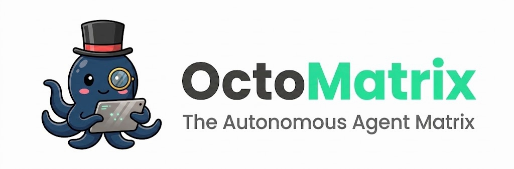
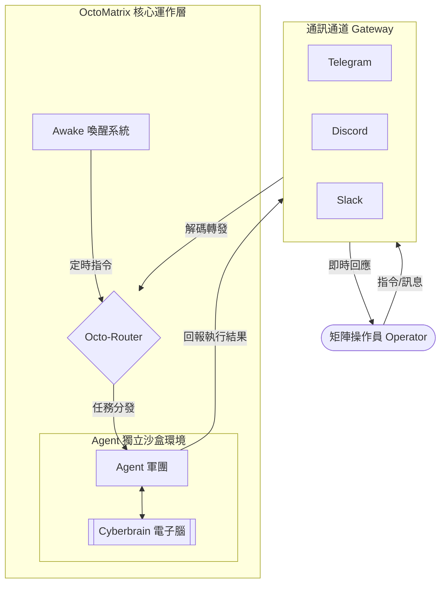
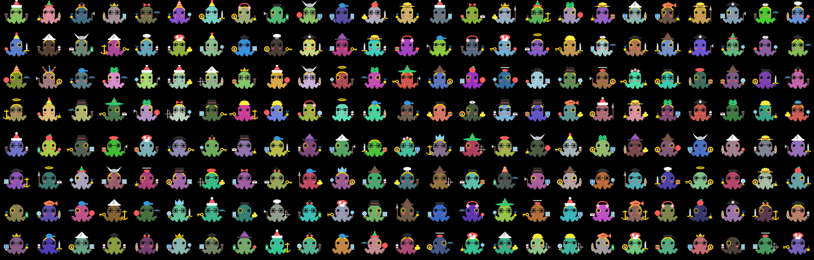
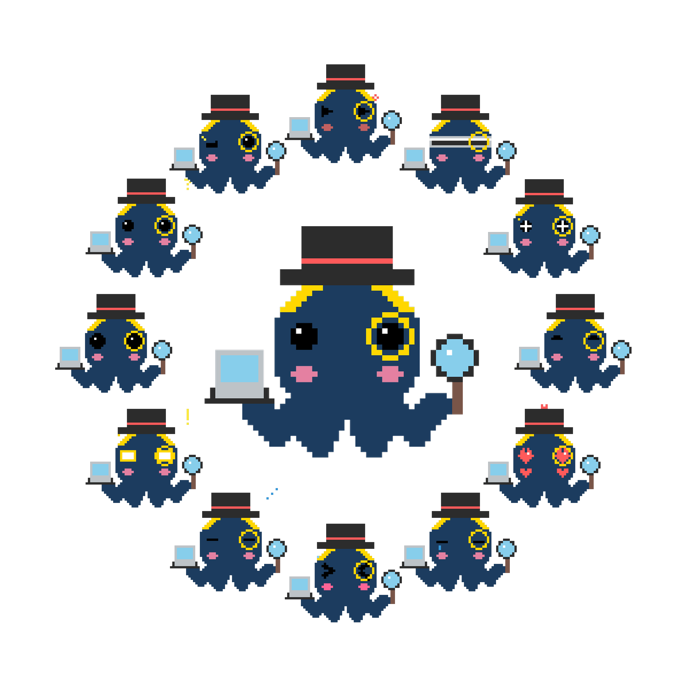
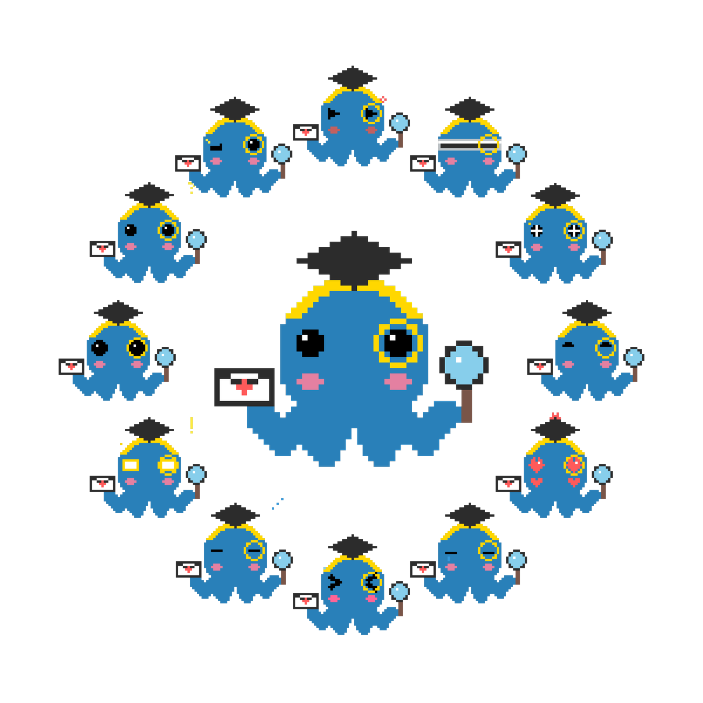

<div align="center">
  
</div>

# 🐙 OctoMatrix: The Autonomous Agent Matrix ☀️🌙

> A Ghost requires a Shell to touch the world, and a Shell requires a Matrix to exist. We forge their Cyberbrains, open the channels, and watch them dive.

## 📖 專案簡介

**OctoMatrix** 是一套專為打破通訊邊界而生的遠端 AI 協作環境。它能將強大的 AI 引擎同時整合至 **Telegram、Discord 與 Slack** 三個精選的通訊軟體中。

這不僅是一個對話機器人，而是一個完整的 **AI 團隊生態系統**。作為「矩陣操作員 (Matrix Operator)」，可隨時隨地透過手機或電腦，指揮多個具備獨特職責的 AI Agent。透過專屬的工作區隔離、動態配置的團隊協作，以及基於 **Cyberbrain (電子腦)** 的長期狀態維持機制，AI 助手將如同真實團隊般在背景持續執行任務。

本系統原生支援 Linux (如 Ubuntu/Debian/CentOS/RHEL) 與 macOS，並支援透過 WSL 在 Windows 上運行。

## 🧩 概念架構


---
## ✨ 核心特色
*   **對話即操作 (Command-Driven)**：只要在通訊軟體發送訊息，即可直接指揮遠端 AI 執行複雜指令與任務。
*   **多代理軍團 (Multi-Agent)**：支援同時配置多個具備不同專長（如資料檢索、程式編寫、邏輯分析）的 Agent。
*   **跨平臺不中斷 (Tri-Channel)**：支援 Telegram、Discord 與 Slack。當常用的通訊平臺不穩定時，隨時切換到另一個平臺，AI 團隊與任務進度依然保持同步。
*   **電子腦系統 (Cyberbrain)**：以「grep-based RAG」取代傳統向量檢索的長期記憶機制。致敬「GHOST in the SHELL」概念，AI 會將對話重點「收攝」與「刻印」為高密度的 GHOST 索引，並透過「深潛 (Deep Dive)」技術從 SHELL 紀錄中物理級提煉歷史脈絡，賦予 Agent 突破上下文窗口限制的高效追溯能力。
*   **行為約束框架 (Agent Harness)**：有別於傳統大語言模型難以預測的黑箱行為，為 Agent 導入了系統級的 Harness 執行框架。透過底層嚴謹的標準化作業流程來收束 AI 的發散性思維，確保每次協作皆可預測、可觀測且高度穩定。
*   **零門檻設定精靈**：提供 100% 互動式的安裝精靈，無需手動修改複雜的程式碼或設定檔，即可輕鬆建立專屬的 AI 團隊。
*   **喚醒任務 (Awake Tasks)**：支援透過自然語言直接指派週期性或定時任務，系統將自動於指定時間喚醒 Agent 執行背景工作。
*   **代理間橫向通訊 (Agent-to-Agent Interaction)**：Agent 之間具備互相交辦與傳遞訊息的能力，能實現分工合作與邏輯覆核。
*   **角色感知 (Role Awareness)**：Agent 具備獨特的人格設定，並會根據對話情境自動發送符合當下情緒的專屬 Avatar 貼圖。

---

## 🎭 角色感知與視覺呈現 (Role Awareness & Avatar Aesthetics)

OctoMatrix 不僅賦予 Agent 執行任務的能力，更強調其「自我認知」與「視覺情緒」。

透過深度的系統提示與情境設定，每位 Agent 皆具備獨特的性格、語氣與職責。伴隨每次的對話與狀態回報，Agent 會自動根據當下情境（如：思考、開心、抱歉、靈光一閃）選擇並發送對應的 Avatar 表情圖檔，為冷硬的終端機對話注入充滿溫度的靈魂。

<p align="center">
  
</p>
<p align="center">
  
  &nbsp;
  
</p>

---

## 📖 取得通訊通道憑證 (至少擇一)

### 1. 獲取 Telegram 憑證 (最簡單)

*   **A. TELEGRAM_BOT_TOKEN**
    1. 在 Telegram 中搜尋官方帳號 **@BotFather** 並開啟對話。
    2. 發送 `/newbot` 指令，依提示輸入機器人名稱。
    3. 創建成功後，BotFather 會提供一組 **HTTP API Token**。

*   **B. TELEGRAM_CHAT_ID**
    1. 確保已在設定精靈中填入 Token。
    2. 發送 `/start` 到 Telegram 中的機器人聊天室。
    3. **設定精靈會自動偵測**並抓取聊天室 ID。

*   **C. ngrok Authtoken**
    1. 註冊並登入 [ngrok](https://dashboard.ngrok.com/get-started/your-authtoken)。
    2. 在頁面左欄找到 **Your Authtoken**。
    3. 複製該 Token，稍後在設定精靈中填入。

### 2. 獲取 Discord 憑證

*   **A. 建立專屬伺服器 (前置作業)**
    1. 若尚無專屬伺服器，請打開 Discord 客戶端，點擊左側列表底部的 **+ 新增伺服器**。
    2. 選擇 **建立自己的伺服器** 並完成建立，以供後續邀請機器人與獲取 ID 使用。

*   **B. DISCORD_BOT_TOKEN**
    1. 前往 [Discord Developer Portal](https://discord.com/developers/applications)。
    2. 點擊右上角的 **New Application**，輸入名稱並建立。
    3. 在左側選單選擇 **Bot**。
    4. 點擊 **Reset Token** 並複製產生的 Token（請妥善保管，只會顯示一次）。
    5. 關閉公開機器人：前往左側選單的 **Installation**，將 **Install Link** 改為 **None**。接著回到 **Bot** 頁面將 **Public Bot** 關閉並儲存，避免陌生人將此專屬機器人加入其他伺服器。（若未先將 Install Link 設為 None，Discord 將不允許儲存此變更）。
    6. 往下捲動並開啟 **Message Content Intent** 開關，否則機器人將無法讀取訊息內容。（註：該頁面最下方的 Bot Permissions 僅為系統預設值，此處請直接忽略，無需勾選）。
    7. 邀請機器人：由於關閉了 Public Bot，無法使用預設授權連結。請前往左側選單的 **OAuth2 > OAuth2 URL Generator**，勾選 **bot** 範圍，並在下方 **Bot Permissions** 勾選所需權限，建議勾選 **檢視頻道 (View Channels)**、**傳送訊息 (Send Messages)**、**讀取訊息歷史記錄 (Read Message History)** 與 **附加檔案 (Attach Files)**。接著複製最下方的網址貼至瀏覽器，即可將機器人加入專屬伺服器。

*   **C. 開啟開發者模式 (前置作業)**
    1. 打開 Discord 客戶端，點擊左下角的 **使用者設定** (齒輪圖示)。
    2. 在左側選單找到 **開發人員**。
    3. 將 **開發者模式** (Developer Mode) 切換為開啟。

*   **D. DISCORD_SERVER_ID**
    1. 在 Discord 伺服器列表中，右鍵點擊目標伺服器的圖示或名稱。
    2. 選擇選單最下方的 **複製伺服器 ID** (Copy Server ID)。

*   **E. DISCORD_CHANNEL_ID**
    1. 在伺服器內建立專屬文字頻道（因已處於封閉的伺服器內，不需開啟私人頻道）。
    2. 在伺服器頻道列表中，右鍵點擊該目標頻道。
    3. 選擇選單最下方的 **複製頻道 ID** (Copy Channel ID)。

### 3. 獲取 Slack 憑證

*   **A. 建立專屬 Workspace (前置作業)**
    1. 若尚無專屬工作區，請先前往 [Slack 官網](https://slack.com/create) 建立。
    2. 依照指示完成建立，以供後續安裝 Slack App 與隔離 AI 對話使用。

*   **B. 建立 Slack App**
    1. 前往 [Slack API: Your Apps](https://api.slack.com/apps) 頁面。
    2. 點擊 **Create New App** 並選擇 **From scratch**。
    3. 命名 App 並選擇剛才建立的 Workspace。

*   **C. SLACK_BOT_TOKEN (xoxb-)**
    1. 在左側選單進入 **Features > OAuth & Permissions**。
    2. 往下捲動至 **Scopes**，在 **Bot Token Scopes** 中加入以下必備權限：
       *   `app_mentions:read` (讀取提及)
       *   `channels:history`, `channels:read` (讀取公開頻道訊息與資訊)
       *   `chat:write` (發送訊息)
       *   `files:read`, `files:write` (讀取與上傳檔案)
       *   `im:history`, `mpim:history` (讀取私訊歷史)
       *   `users:read` (讀取使用者資訊)
    3. 回到頁面頂端點擊 **Install to Workspace** 並完成授權。
    4. 複製產生的 **Bot User OAuth Token** (開頭為 `xoxb-`)。

*   **D. SLACK_APP_TOKEN (xapp-)**
    1. 在左側選單進入 **Settings > Basic Information**。
    2. 往下捲動至 **App-Level Tokens** 區塊。
    3. 點擊 **Generate Token and Scopes**，輸入名稱並加入 `connections:write` 權限 (Socket Mode 必備)。
    4. 點擊產生並複製 Token (開頭為 `xapp-`)。

*   **E. 啟用 Socket Mode**
    1. 在左側選單進入 **Settings > Socket Mode**。
    2. 將 **Enable Socket Mode** 切換為開啟。

*   **F. 設定 Event Subscriptions (Socket Mode 必備)**
    1. 在左側選單進入 **Features > Event Subscriptions**。
    2. 將 **Enable Events** 切換為開啟。
    3. 展開 **Subscribe to bot events** 區塊，加入以下權限：
       *   `app_mention`
       *   `file_shared`
       *   `message.channels`
       *   `message.im`
       *   `message.mpim`
    4. 點擊 **Save Changes**。

*   **G. SLACK_WORKSPACE_ID & SLACK_CHANNEL_ID**
    1. 在 Workspace 內建立一個專屬頻道（因已處於封閉的工作區內，直接使用公開頻道即可）。
    2. 登入網頁版 [app.slack.com](https://app.slack.com/) 並進入該目標頻道。
    3. 觀察網址列，結構通常為 `https://app.slack.com/client/T.../C...`。
    4. **Workspace ID** 為網址中的 `T` 開頭字串。
    5. **Channel ID** 為網址中的 `C` 開頭字串。
    6. *注意：必須在目標頻道輸入 `/invite @機器人名稱` 邀請機器人加入，機器人才能發送訊息。*
---

## 🚀 快速開始

OctoMatrix 簡化了繁瑣的手動編輯設定檔，提供了友善的互動式安裝精靈。只需要按照終端機的提示依序進行，系統就會自動完成所有配置！

### 1. 取得原始碼與安裝環境依賴
首先，取得專案程式碼，並執行內建的安裝腳本，系統會自動安裝所需的 Python 套件、Node.js 以及各家 AI CLI 工具。
```bash
git clone -b zh-version https://github.com/meso4444/OctoMatrix.git
cd OctoMatrix

# 安裝基礎環境依賴 (Local 環境必備)
./install_dependencies.sh
```

### 2. 執行全端設定精靈 (Setup Wizard)
依賴安裝完成後，啟動互動式設定精靈。可以在這個集中化選單中，完成所有系統設定：
```bash
./setup_config.sh
```

**精靈主選單功能：**
*   **[1] 👤 設定使用者暱稱 (Username)**：設定您的稱呼，Agent 會以此名稱來稱呼您。
*   **[2]-[4] 通訊通道設定**：引導綁定 Telegram、Discord 或 Slack 的 Token，並可隨時開關特定通道。
*   **[5] 🌍 設定網路與連接埠 (Ports)**：自訂 Router、Gateway 與 ngrok 隧道的本地 Port口，避免與主機其他服務衝突。
*   **[6] 🤖 設定 AI Agent 軍團與進階參數**：
    *   **配置 Agent**：為 AI 命名，指定它的 **職責 (usecase)**（用於 AI 認知）與 **描述 (description)**（用於選單展示給使用者），並自由搭配 AI 引擎（Gemini、Claude、Codex 或 agy (Antigravity)）與模型。
        > **注意：** 建議改用 agy (Antigravity) 引擎較為穩定，且 gemini CLI 已不再支援 Pro 訂閱用戶。
    *   **配置 Agent 協作群組**：建立團隊共享空間，並指定群組內的 Agent 之間互相監督與交辦任務的對接關係。
    *   **通訊選單配置**：除了系統已內建基礎選單，還可以「自訂專屬按鈕」，將常用的提示詞或指令綁定至圖形化按鍵，一鍵發送。
*   **[7] 🔐 AI Agent CLI 認證設定**：內建認證流程，協助一鍵呼叫 Google、Anthropic 或 OpenAI 的授權介面完成終端登入。
*   **[8] ⬆️ AI CLI 版本管理 (升級/退版)**：內建各家 AI CLI 工具的升級與退版機制，保障底層工具版本與專案的最佳相容性。
*   **[9] 📦 執行全域技能建置 (Install Agent Skills)**：將 [`skills`](./skills) 目錄下的技能包解壓建置至全域快取，並自動部署給所有 Agent。

### 3. 啟動系統 (Native 本機模式)
完成上述精靈設定與認證後，就可以直接在本機啟動 AI 矩陣了！
```bash
./start_octo_services.sh
```

### 4. 容器化部署 (Docker 可選進階模式)
如果希望在同一台伺服器上運行多組獨立的矩陣，或是希望擁有更嚴格的系統隔離，也可以選擇使用 Docker 進行部署。
```bash
./install_docker.sh
cd docker-deploy

# 1. 執行 Docker 專屬精靈，依照提示產生設定
./setup_docker.sh

# 2. 啟動專屬容器
docker compose -f docker-compose.${INSTANCE_NAME}.yml -p octo_${INSTANCE_NAME} build --no-cache && docker compose -f docker-compose.${INSTANCE_NAME}.yml -p octo_${INSTANCE_NAME} up -d
```

---

## 🛠️ 開機自啟與進階部署 (Auto-Startup & Deployment)

OctoMatrix 支援將服務設定為系統常駐（不死鳥模式），讓您的 AI 團隊在主機重啟後能自動復活。
* **Linux 環境**：請參考 [`auto-startup`](./auto-startup) 目錄下的說明文件，透過 Systemd 建立背景服務。
* **Windows 系統**：建議透過 WSL (Windows Subsystem for Linux) 進行部署，請參考 [`windows-wsl-setup`](./windows-wsl-setup) 目錄，透過內附的腳本可快速建立無縫的 AI 運行環境。
* **macOS 系統**：請參考 [`auto-startup`](./auto-startup) 目錄下針對 `launchd` 的說明文件，以原生的方式註冊背景守護行程。

---

## 🎒 技能擴充 (Skills)

OctoMatrix 提供高度模組化的技能擴充機制。完整封裝規範請參考 [`skills/octo_skill_packaging_guidelines.md`](./skills/octo_skill_packaging_guidelines.md)。

1. **新增技能包**：只需將開發好的技能包（支援 `.tar.gz` 或 `.zip` 格式）放置於 [`skills`](./skills) 目錄下即可。
2. **建議架構**：為了確保技能能在各環境中無縫運作，您的技能包應包含：
   * `SKILL.md`（必備）：Agent 讀取技能用法的唯一說明書。
   * `requirements.txt`（選配）：宣告所需的 Python 依賴。
   * `setup.sh`（選配）：用於安裝系統層級的依賴包（如 apt-get 套件）或 Node.js 等其他套件。
3. **建置技能**：透過 `./setup_config.sh` 設定精靈的 **[9] 執行全域技能建置**。此操作會將 `skills` 目錄下所有技能包解壓至全域快取並**部署給所有 Agent**。若使用 Docker 部署，`setup_docker.sh` 設定精靈在設置實例時會自動執行相同的建置流程；也可隨時透過精靈的 **[7] 執行全域技能建置** 獨立重新建置，不需要重跑整個實例設置流程。

---

## ⌨️ 內建指令與功能說明 (Built-in Commands)

除了自然語言對話外，您可以透過通訊軟體發送系統指令來管理 Agent 的狀態。
**注意：Telegram 與 Discord 請使用斜線 `/` 作為前綴，Slack 請使用驚嘆號 `!` 作為前綴。**

* **`/status`**：查看所有 Agent 的存活狀態、已註冊的喚醒任務以及各通訊通道的連線健康度。
* **`/switch [Agent名稱]`**：切換當前頻道正在對話的目標 Agent。
* **`/clear`**：清除通訊視窗畫面，並徹底重置該 Agent 的對話上下文與短期記憶，但不影響已刻印的 GHOST 記憶。
* **`/interrupt`**：向活躍的 Agent 發送 Ctrl+C，強制中斷可能卡死或陷入無窮迴圈的執行程序。
* **`/fix [Agent名稱]`**：強制重啟並嘗試恢復對話。若 AI 卡住或無回應時可使用此指令。
* **`/capture [Agent名稱]`**：擷取指定 Agent 運行視窗最近 50 行的終端機輸出，可用於檢查底層的執行報錯。
* **`/inspect [Agent名稱]`**：指派當前的 AI 去檢查另一位 AI 的狀態與錯誤訊息。
* **`/resume_latest`**：當發生非預期的中斷時，嘗試從 CLI 的本地快取中恢復最近一次的對話紀錄。
* **`/sys_refresh`**：檢查並強制更新 Agent 所遵守的系統協定與行為規範。
* **`/avatar_renew [需求]`**：根據給定的需求，動態為 Agent 生成並更新專屬的 Avatar 貼圖組。
* **`/menu`**：在支援的平臺上（如 Telegram）彈出實體管理按鍵選單，方便手機用戶點擊操作。
* **`/help`**：顯示幫助選單，列出可用的系統指令與操作說明。

---

## ⏰ 喚醒系統 (Awake System)

當系統啟動並與 Agent 建立連線後，可以直接透過對話要求 Agent 建立定時「喚醒」任務。例如可以吩咐它在每天早晨自動喚醒並統整當日新聞，或是定期巡檢特定系統狀態。所有排程的建立與撤銷皆可直接透過自然語言對話完成。

---

## 🤝 Agent 對話與橫向協作 (Agent-to-Agent Interaction)

OctoMatrix 具備先進的 Agent 橫向通訊機制，允許 AI 團隊成員之間互相交流與交辦任務：

* **觸發方式**：當使用者明確要求 Agent 和 Agent 協作夥伴進行協作任務，或者在設定精靈的協作定義中已明確定義特定任務需要交由 Agent 夥伴進行協作時，Agent 便會主動發起通訊。
* **運作機制**：訊息會透過內部的安全 API 路由 (Router) 進行精準投遞。接收方的 Agent 在收到訊息後，會自動建立背景任務處理需求，並在完成後主動將結果或報告回傳給委託的 Agent 或操作員。整個過程具備防無限迴圈的自我驗證機制，確保團隊協作高效且安全。

---

## 🔒 隱私與安全設計 (Privacy & Security)

OctoMatrix 針對三大通訊平臺，皆採用無需破壞主機防火牆的連線架構，確保系統的隱私與運行安全：

*   **Telegram (Webhook 隧道)**：透過動態配置的 `ngrok` 建立安全的 HTTPS 逆向隧道。主機不需對外開放任何 Port，Webhook 網址亦為每次啟動動態產生，大幅降低被探測攻擊的風險。
*   **Discord (WebSocket 直連)**：採用基於 WebSocket 的即時雙向通訊協議。主機純粹作為 Client 往外連線，穿透內網限制。
*   **Slack (Socket Mode)**：採用企業級的 Socket Mode 連線。不依賴公開的 Request URL，所有事件與指令皆透過安全隧道進行雙向傳輸。
*   **權限隔離防護網 (Privilege Isolation & Sandboxing)**：無論訊息來自哪個通道，Agent 皆於專屬的 Linux 使用者帳戶與獨立的 `agent_home` 目錄下運行。這種設計讓 Agent 嚴格受限於該使用者所具有的最小權限 (Least Privilege)；只有在 `agent_home` 中的檔案與目錄才具有較完整的操作權，而系統賦予的系統腳本與核心文件皆已拔除其寫入權限，從系統底層精準防止任何越權竄改的風險。

---

## 📄 授權 (License)
本專案基於 [Apache License 2.0](./LICENSE) 授權。